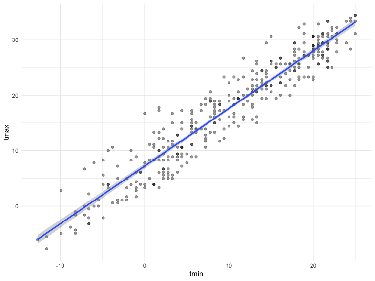
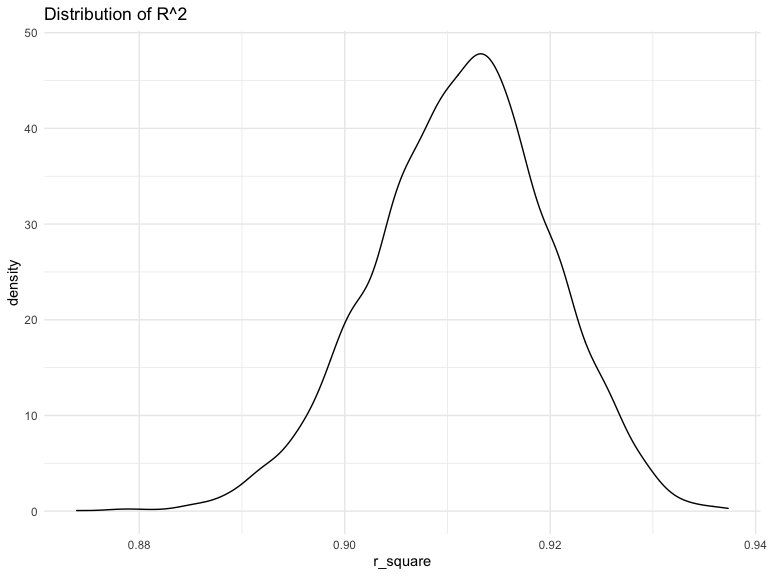
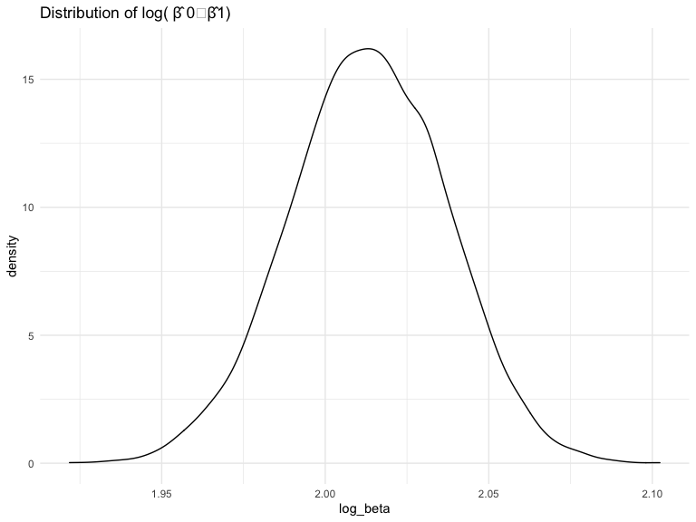

hw6
================
Kexin Sun
12/8/2020

``` r
library(tidyverse)
```

    ## ── Attaching packages ─────────────────────────────────────────────── tidyverse 1.3.0 ──

    ## ✓ ggplot2 3.3.2     ✓ purrr   0.3.4
    ## ✓ tibble  3.0.4     ✓ dplyr   1.0.2
    ## ✓ tidyr   1.1.2     ✓ stringr 1.4.0
    ## ✓ readr   1.3.1     ✓ forcats 0.5.0

    ## ── Conflicts ────────────────────────────────────────────────── tidyverse_conflicts() ──
    ## x dplyr::filter() masks stats::filter()
    ## x dplyr::lag()    masks stats::lag()

``` r
library(readxl)
library(patchwork)


knitr::opts_chunk$set(
  fig.height = 6,
  fig.width = 8,
  message = F,
  echo = T,
  warning = F
)
theme_set(theme_minimal() + theme(legend.position = "bottom"))
options(
  ggplot2.continuous.colour = "viridis",
  ggplot2.continuous.fill = "viridis",
  digits = 3
)
scale_colour_discrete = scale_colour_viridis_d
scale_fill_discrete = scale_fill_viridis_d
```

## Problem 3

``` r
weather_df =
  rnoaa::meteo_pull_monitors(
    c("USW00094728"),
    var = c("PRCP", "TMIN", "TMAX"),
    date_min = "2017-01-01",
    date_max = "2017-12-31"
  ) %>%
  mutate(
    name = recode(id, USW00094728 = "CentralPark_NY"),
    tmin = tmin / 10,
    tmax = tmax / 10
  ) %>%
  select(name, id, everything())
```

Get the distribution plot:

``` r
weather_df %>%
  ggplot(aes(x = tmin, y = tmax)) +
  geom_point(alpha = 0.4) +
  geom_smooth(method = "lm")
```

<!-- -->

Bootstrap:

``` r
set.seed(1)
weather_bootstrap =
  modelr::bootstrap(weather_df,
                    n = 5000,
                    id = "id") %>%
  mutate(
    strap = map(strap, as_tibble),
    md =
      map(.x = strap,
          ~ lm(tmax ~ tmin, data = .x)),
    r_square =
      map2_dbl(.x = md,
               .y = strap,
               ~ modelr::rsquare(.x, .y)),
    md = map(md, broom::tidy)
  ) %>%
  unnest(md) %>%
  select(id, term, estimate, std_error = std.error, r_square)

weather_bootstrap %>% head() %>% knitr::kable()
```

| id   | term        | estimate | std\_error | r\_square |
| :--- | :---------- | -------: | ---------: | --------: |
| 0001 | (Intercept) |     7.45 |      0.223 |     0.907 |
| 0001 | tmin        |     1.03 |      0.017 |     0.907 |
| 0002 | (Intercept) |     7.36 |      0.243 |     0.896 |
| 0002 | tmin        |     1.03 |      0.019 |     0.896 |
| 0003 | (Intercept) |     7.48 |      0.215 |     0.918 |
| 0003 | tmin        |     1.04 |      0.016 |     0.918 |

The 95% confidence interval of r̂ squared and log(β̂ 0∗ β̂ 1).

``` r
weather_bootstrap %>%
  distinct(id, r_square) %>%
  summarise(lower = quantile(r_square, 0.025),
            upper = quantile(r_square, 0.975)) %>%
  knitr::kable()
```

| lower | upper |
| ----: | ----: |
| 0.894 | 0.927 |

``` r
weather_bootstrap %>%
  select(id, term, estimate) %>%
  pivot_wider(names_from = term,
              values_from = estimate
              ) %>%
  janitor::clean_names() %>%
  mutate(log_beta =log(tmin * intercept)) %>%
  summarise(lower = quantile(log_beta, 0.025),
            upper = quantile(log_beta, 0.975)
            ) %>%
  knitr::kable()
```

| lower | upper |
| ----: | ----: |
|  1.97 |  2.06 |

The 95% confidence interval for r̂ squared is (0.894, 0.927)

The 95% confidence interval for log(Beta1\*Beta2) is (1.97, 2.06)

The distribution plot:

``` r
weather_bootstrap %>%
  distinct(id, r_square) %>%
  ggplot(aes(x = r_square)) +
  geom_density()+
  labs(
    title = "Distribution of R^2"
  )
```

<!-- -->

``` r
weather_bootstrap %>%
  select(id, term, estimate) %>%
  pivot_wider(names_from = term,
              values_from = estimate) %>%
  janitor::clean_names() %>%
  mutate(log_beta =
           log(tmin * intercept)) %>%
  ggplot(aes(x = log_beta)) +
  geom_density() +
  labs(
    title = "Distribution of log( β̂ 0∗β̂1)"
  )
```

<!-- -->

The distribution of r̂ squared is approximately normal and follows the
Central Limit Theroem. The distribution centered around 0.915

The distribution of log(beta0hat and the beta1hat) is approximately
normal and follows the Central Limit Theroem. The distribution centered
around 2.02
